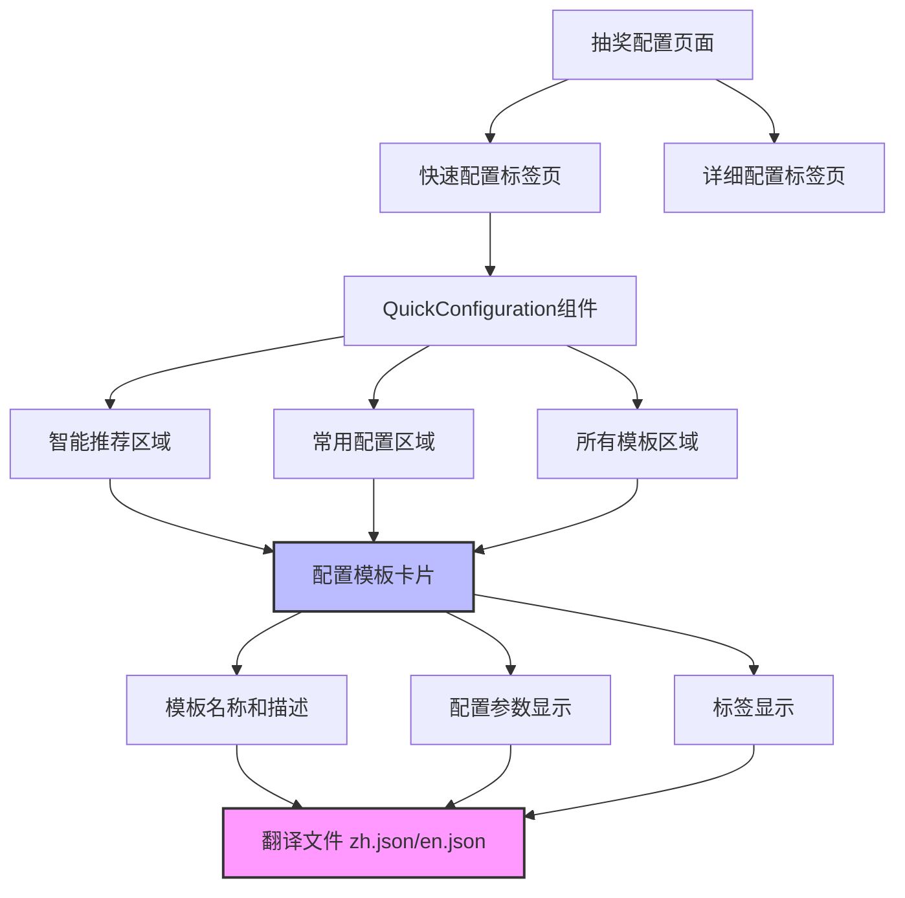

# 抽奖配置页面国际化修复设计文档

## 概述

本设计文档旨在解决抽奖配置页面中的国际化问题，主要包括"快速配置"标签页显示翻译键、快速配置模板参数显示英文等问题。通过系统性的分析和修复，确保中文用户获得完整的本地化体验。

## 架构

### 问题分析

通过代码分析，发现以下主要问题：

1. **翻译键缺失**：`drawConfig.quickConfigTab` 在翻译文件中存在，但可能存在加载时机问题
2. **快速配置模板翻译键缺失**：`quickConfigTemplates.*` 相关的翻译键在 zh.json 和 en.json 中完全缺失
3. **组件内硬编码文本**：快速配置组件中存在部分硬编码的英文文本
4. **体验模板翻译键缺失**：`experienceTemplates.*` 相关的翻译键也可能存在缺失

### 架构设计



## 组件和接口

### 翻译键结构设计

#### 1. 快速配置模板翻译键

```typescript
interface QuickConfigTemplateTranslations {
  quickConfigTemplates: {
    [templateId: string]: {
      name: string
      description: string
      tags: string[]
    }
  }
}
```

#### 2. 体验模板翻译键

```typescript
interface ExperienceTemplateTranslations {
  experienceTemplates: {
    [templateId: string]: {
      name: string
      description: string
      tags: string[]
    }
    sampleData: {
      students: Record<string, string>
      employees: Record<string, string>
      prizes: Record<string, string>
      // ... 其他示例数据
    }
  }
}
```

### 组件修复点

#### 1. QuickConfiguration 组件

- **问题**：模式名称显示、参数标签、提示信息等存在英文
- **解决方案**：添加完整的翻译键支持

#### 2. 抽奖配置页面

- **问题**：标签页翻译键可能存在加载问题
- **解决方案**：确保翻译键正确加载和使用

## 数据模型

### 翻译文件结构

```json
{
  "drawConfig": {
    "quickConfigTab": "快速配置"
  },
  "quickConfig": {
    "drawQuantity": "抽取数量",
    "allowRepeat": "允许重复",
    "notAllow": "不允许",
    "drawMode": "抽取模式",
    "intelligent": "智能",
    "modes": {
      "slotMachine": "老虎机",
      "cardFlip": "翻牌",
      "bulletScreen": "弹幕",
      "gridLottery": "宫格",
      "blinkingNamePicker": "闪烁"
    }
  },
  "quickConfigTemplates": {
    "classroomNaming": {
      "name": "课堂点名",
      "description": "随机选择学生回答问题",
      "tags": ["教育", "互动", "单选", "公平"]
    }
    // ... 其他模板
  },
  "experienceTemplates": {
    // ... 体验模板翻译
  }
}
```

## 错误处理

### 翻译键缺失处理

1. **降级策略**：当翻译键缺失时，显示键名而不是空白
2. **开发环境警告**：在开发环境下输出缺失翻译键的警告
3. **默认语言回退**：优先使用中文，英文作为回退

### 组件错误边界

1. **翻译函数错误**：确保翻译函数调用不会导致组件崩溃
2. **数据格式错误**：处理翻译数据格式不正确的情况

## 测试策略

### 单元测试

1. **翻译键覆盖测试**：验证所有使用的翻译键都存在对应翻译
2. **组件渲染测试**：验证组件在不同语言下正确渲染
3. **翻译函数测试**：验证翻译函数正确处理参数和回退

### 集成测试

1. **页面级测试**：验证整个抽奖配置页面的国际化功能
2. **用户流程测试**：验证完整的配置流程中所有文本都正确显示
3. **语言切换测试**：验证语言切换时所有文本都正确更新

### 视觉回归测试

1. **截图对比**：对比修复前后的页面截图
2. **多语言截图**：验证中英文环境下的页面显示
3. **响应式测试**：验证不同屏幕尺寸下的显示效果

## 实现优先级

### 高优先级
1. 修复 `drawConfig.quickConfigTab` 显示问题
2. 添加快速配置模板的完整翻译键
3. 修复快速配置组件中的硬编码文本

### 中优先级
1. 添加体验模板的翻译键
2. 完善错误处理和回退机制
3. 添加开发环境的翻译键检查

### 低优先级
1. 优化翻译键的组织结构
2. 添加翻译键使用的文档
3. 实现翻译键的自动化检查工具

## 性能考虑

### 翻译文件大小

- **问题**：添加大量翻译键可能增加文件大小
- **解决方案**：合理组织翻译键结构，避免重复

### 运行时性能

- **翻译函数调用**：确保翻译函数调用不会影响组件渲染性能
- **内存使用**：避免创建过多的翻译对象实例

### 加载性能

- **按需加载**：考虑是否需要按需加载翻译文件
- **缓存策略**：利用浏览器缓存减少重复加载