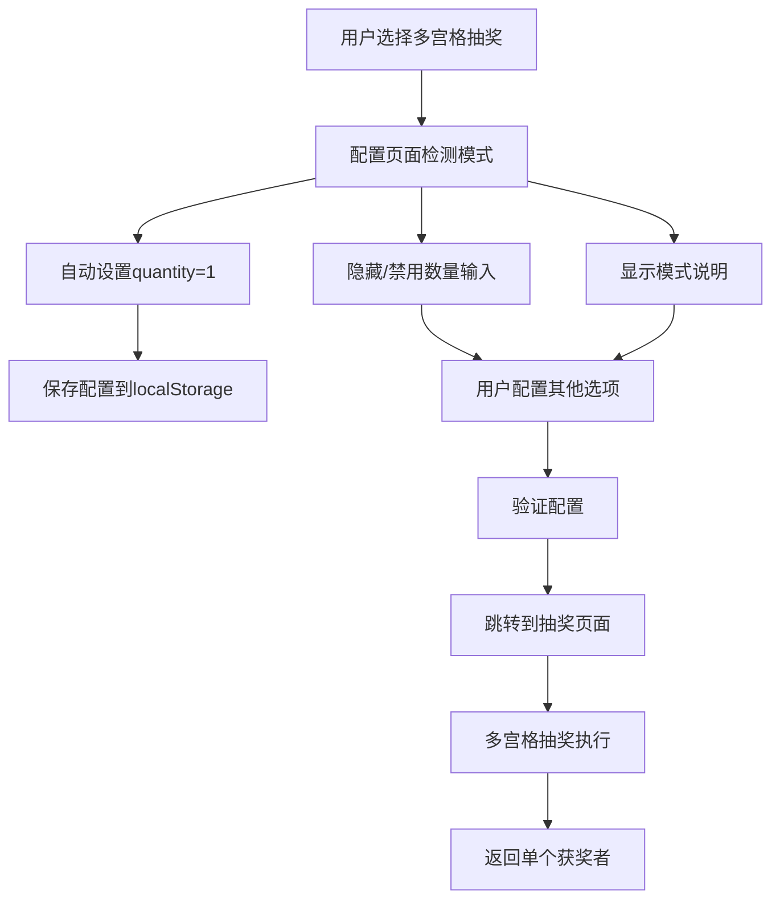
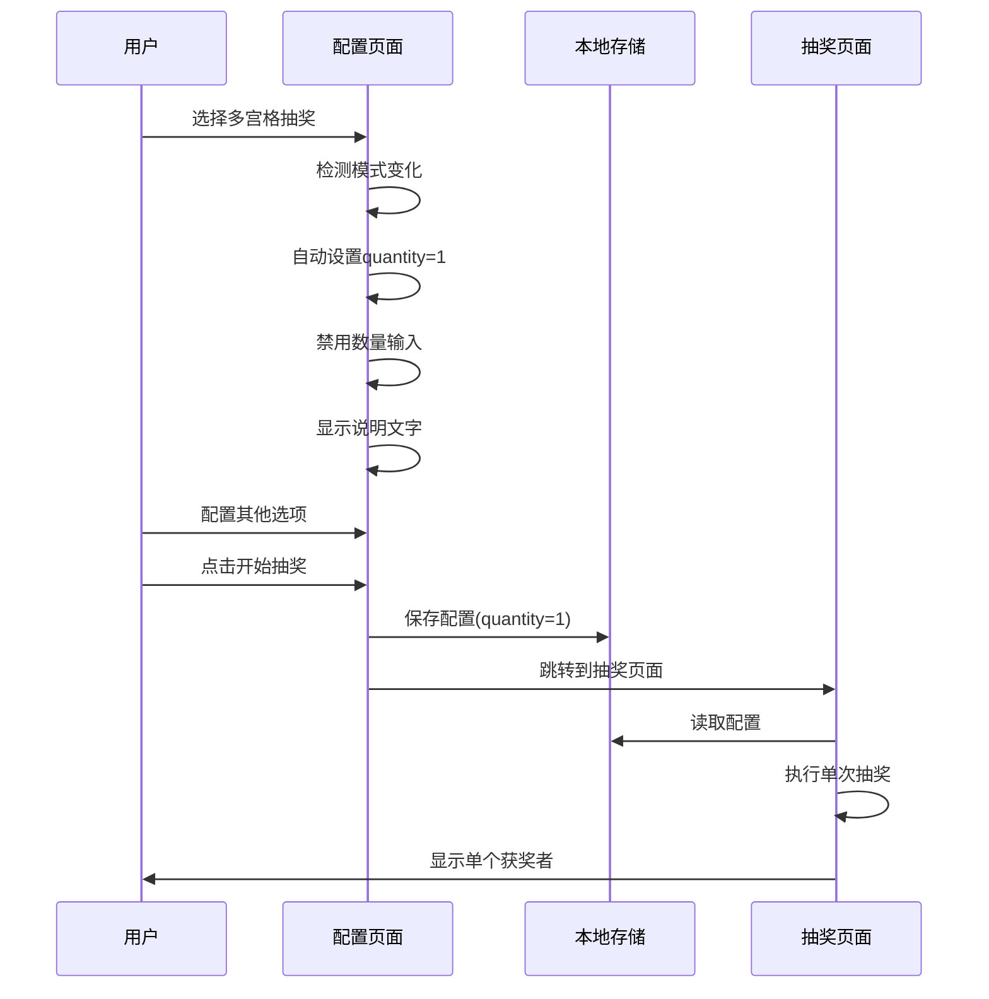

# Design Document

## Overview

多宫格抽奖模式的核心特点是通过灯光在多个宫格间跳转，最终定格在一个获奖者上。这种抽奖方式的本质决定了它应该一次只能抽取一个结果。本设计将优化配置流程，移除用户对抽取数量的配置，改为系统自动设置为单次抽取模式，同时保持其他配置选项的灵活性。

## Architecture

### 核心设计原则

1. **模式特定配置**：不同抽奖模式应该有不同的配置界面和限制
2. **用户体验一致性**：配置流程保持统一，只在特定模式下调整相关选项
3. **智能默认值**：系统自动设置合理的默认配置，减少用户困惑
4. **向后兼容**：确保现有的配置数据结构和API不受影响

### 系统架构图



## Components and Interfaces

### 1. 配置页面组件修改

#### DrawConfigPage 组件增强

```typescript
// 新增：模式特定的配置处理
interface ModeSpecificConfig {
  showQuantityInput: boolean
  quantityValue: number | 'auto'
  quantityEditable: boolean
  description: string
  helpText?: string
}

const getModeSpecificConfig = (mode: DrawingMode): ModeSpecificConfig => {
  switch (mode) {
    case 'grid-lottery':
      return {
        showQuantityInput: true,
        quantityValue: 1,
        quantityEditable: false,
        description: '多宫格抽奖固定为单次抽取',
        helpText: '多宫格抽奖通过灯光跳转选择一个获奖者'
      }
    default:
      return {
        showQuantityInput: true,
        quantityValue: 'auto',
        quantityEditable: true,
        description: getQuantityLimitDescription(mode, allowRepeat, itemCount)
      }
  }
}
```

#### 数量输入组件状态管理

```typescript
// 修改现有的数量输入处理逻辑
const handleModeChange = (newMode: DrawingMode) => {
  setSelectedMode(newMode)
  
  const modeConfig = getModeSpecificConfig(newMode)
  if (modeConfig.quantityValue !== 'auto') {
    setQuantity(modeConfig.quantityValue as number)
  }
}

// 数量输入组件渲染逻辑
const renderQuantityInput = () => {
  const modeConfig = getModeSpecificConfig(selectedMode)
  
  return (
    <div className="space-y-2">
      <Label htmlFor="quantity">抽取数量</Label>
      <Input
        id="quantity"
        type="number"
        min="1"
        max={getMaxQuantityForMode(selectedMode, allowRepeat, items.length)}
        value={quantity}
        disabled={!modeConfig.quantityEditable}
        onChange={modeConfig.quantityEditable ? handleQuantityChange : undefined}
        className={!modeConfig.quantityEditable ? "bg-gray-100 cursor-not-allowed" : ""}
      />
      <p className="text-sm text-gray-500">
        {modeConfig.description}
      </p>
      {modeConfig.helpText && (
        <p className="text-sm text-blue-600 bg-blue-50 p-2 rounded">
          💡 {modeConfig.helpText}
        </p>
      )}
    </div>
  )
}
```

### 2. 类型定义扩展

#### DrawingConfig 接口保持不变

```typescript
// 保持现有接口不变，确保向后兼容
export interface DrawingConfig {
  mode: DrawingMode
  quantity: number  // 多宫格模式下始终为1
  allowRepeat: boolean
  listId?: string
  items: ListItem[]
}
```

#### 新增模式配置类型

```typescript
export interface ModeConfiguration {
  mode: DrawingMode
  quantityConfig: {
    fixed: boolean
    value?: number
    min?: number
    max?: number
    description: string
  }
  uiConfig: {
    showQuantityInput: boolean
    quantityEditable: boolean
    helpText?: string
  }
}
```

### 3. 多宫格抽奖页面优化

#### 界面标识优化

```typescript
// 在多宫格抽奖页面添加单次抽取标识
const GridLotteryHeader = () => (
  <div className="flex items-center gap-4">
    <Badge variant="secondary" className="bg-indigo-100 text-indigo-700">
      <Hash className="w-3 h-3 mr-1" />
      单次抽取
    </Badge>
    <Badge variant="secondary" className="bg-purple-100 text-purple-700">
      <Users className="w-3 h-3 mr-1" />
      {config.items.length} 项目
    </Badge>
  </div>
)
```

#### 结果显示优化

```typescript
// 优化结果显示，强调单个获奖者
const getDrawResult = (): DrawResult => ({
  winners: gameState.winner ? [gameState.winner] : [],
  timestamp: new Date().toISOString(),
  mode: "多宫格抽奖（单次抽取）",
  totalItems: config?.items.length || 0,
})
```

## Data Models

### 配置数据流



### 宫格布局算法

```typescript
interface GridLayoutConfig {
  itemCount: number
  gridSize: 6 | 9 | 12 | 15
  layout: {
    rows: number
    cols: number
  }
  fillStrategy: 'repeat' | 'empty' | 'random'
}

const determineOptimalGrid = (itemCount: number, allowRepeat: boolean): GridLayoutConfig => {
  // 根据项目数量和重复设置确定最佳布局
  if (itemCount <= 6) {
    return {
      itemCount,
      gridSize: 6,
      layout: { rows: 2, cols: 3 },
      fillStrategy: allowRepeat ? 'repeat' : 'empty'
    }
  }
  // ... 其他布局逻辑
}
```

## Error Handling

### 配置验证

```typescript
const validateGridLotteryConfig = (config: DrawingConfig): ValidationResult => {
  const errors: string[] = []
  const warnings: string[] = []

  // 验证多宫格模式的特定要求
  if (config.mode === 'grid-lottery') {
    if (config.quantity !== 1) {
      errors.push('多宫格抽奖模式必须设置为单次抽取')
    }
    
    if (config.items.length === 0) {
      errors.push('多宫格抽奖需要至少1个参与项目')
    }
    
    if (config.items.length > 15) {
      warnings.push('项目数量超过15个，将随机选择15个填充宫格')
    }
  }

  return {
    isValid: errors.length === 0,
    errors,
    warnings
  }
}
```

### 运行时错误处理

```typescript
const handleGridLotteryError = (error: GridLotteryError) => {
  switch (error.type) {
    case 'INVALID_QUANTITY':
      toast({
        title: "配置错误",
        description: "多宫格抽奖只支持单次抽取，请重新配置",
        variant: "destructive",
      })
      router.push('/draw-config')
      break
      
    case 'INSUFFICIENT_ITEMS':
      toast({
        title: "项目不足",
        description: "多宫格抽奖需要至少1个参与项目",
        variant: "destructive",
      })
      break
      
    default:
      // 通用错误处理
      break
  }
}
```

## Testing Strategy

### 单元测试

```typescript
describe('Grid Lottery Single Draw Configuration', () => {
  test('should auto-set quantity to 1 when grid-lottery mode is selected', () => {
    const { result } = renderHook(() => useDrawConfig())
    
    act(() => {
      result.current.setMode('grid-lottery')
    })
    
    expect(result.current.quantity).toBe(1)
    expect(result.current.isQuantityEditable).toBe(false)
  })
  
  test('should show appropriate help text for grid-lottery mode', () => {
    render(<DrawConfigPage />)
    
    fireEvent.click(screen.getByText('多宫格抽奖'))
    
    expect(screen.getByText('多宫格抽奖固定为单次抽取')).toBeInTheDocument()
    expect(screen.getByText('多宫格抽奖通过灯光跳转选择一个获奖者')).toBeInTheDocument()
  })
})
```

### 集成测试

```typescript
describe('Grid Lottery End-to-End Flow', () => {
  test('should complete single draw flow successfully', async () => {
    // 1. 配置阶段
    render(<DrawConfigPage />)
    fireEvent.click(screen.getByText('多宫格抽奖'))
    fireEvent.click(screen.getByText('开始抽奖'))
    
    // 2. 抽奖阶段
    await waitFor(() => {
      expect(screen.getByText('多宫格抽奖')).toBeInTheDocument()
    })
    
    fireEvent.click(screen.getByText('开始抽奖'))
    
    // 3. 结果验证
    await waitFor(() => {
      expect(screen.getByText(/获奖者：/)).toBeInTheDocument()
    }, { timeout: 10000 })
  })
})
```

### 用户体验测试

```typescript
describe('User Experience Validation', () => {
  test('should prevent user confusion about quantity setting', () => {
    render(<DrawConfigPage />)
    
    // 选择其他模式，数量输入应该可用
    fireEvent.click(screen.getByText('老虎机式'))
    expect(screen.getByRole('spinbutton')).not.toBeDisabled()
    
    // 切换到多宫格模式，数量输入应该被禁用
    fireEvent.click(screen.getByText('多宫格抽奖'))
    expect(screen.getByRole('spinbutton')).toBeDisabled()
    expect(screen.getByDisplayValue('1')).toBeInTheDocument()
  })
})
```

## Implementation Considerations

### 向后兼容性

1. **配置数据结构**：保持现有的 `DrawingConfig` 接口不变
2. **API 兼容性**：现有的抽奖执行逻辑无需修改
3. **存储格式**：localStorage 中的数据格式保持一致

### 性能优化

1. **配置检测**：使用 `useMemo` 缓存模式特定配置
2. **组件渲染**：避免不必要的重新渲染
3. **状态管理**：优化状态更新逻辑

### 可扩展性

1. **模式配置系统**：设计通用的模式配置框架，便于未来添加新模式
2. **配置验证**：建立可扩展的验证系统
3. **UI 组件**：创建可复用的配置组件

## Migration Strategy

### 现有用户数据处理

```typescript
const migrateGridLotteryConfig = (config: DrawingConfig): DrawingConfig => {
  if (config.mode === 'grid-lottery' && config.quantity !== 1) {
    return {
      ...config,
      quantity: 1
    }
  }
  return config
}
```

### 渐进式部署

1. **阶段1**：更新配置页面，添加模式检测逻辑
2. **阶段2**：优化多宫格抽奖页面的UI显示
3. **阶段3**：添加数据迁移和验证逻辑
4. **阶段4**：完善测试和文档