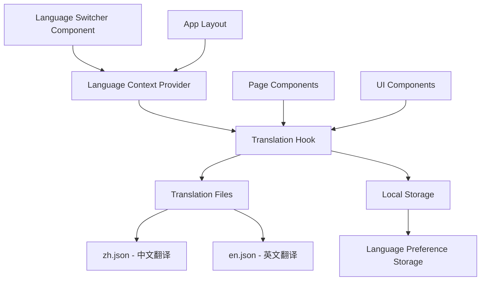

# Design Document

## Overview

本设计文档描述了为趣抽应用添加国际化语言切换功能的技术实现方案。该功能将在顶部导航栏添加一个语言切换按钮，支持中文和英文之间的切换，并提供完整的界面翻译支持。

设计基于现有的Next.js 15 + React 19 + TypeScript技术栈，使用Radix UI组件库和Tailwind CSS样式系统，确保与现有代码风格和架构保持一致。

## Architecture

### 整体架构设计



### 核心架构原则

1. **Context-based State Management**: 使用React Context管理全局语言状态
2. **Hook-based Translation**: 提供自定义Hook简化组件中的翻译使用
3. **JSON-based Translation Files**: 使用结构化JSON文件存储翻译内容
4. **Local Storage Persistence**: 用户语言偏好持久化存储
5. **Type-safe Translation Keys**: TypeScript类型安全的翻译键名

## Components and Interfaces

### 1. Language Switcher Component

**位置**: `components/language-switcher.tsx`

```typescript
interface LanguageSwitcherProps {
  className?: string
  variant?: 'default' | 'compact'
}

interface Language {
  code: 'zh' | 'en'
  name: string
  nativeName: string
  flag: string
}
```

**功能特性**:
- 使用Radix UI DropdownMenu组件
- 显示当前语言标识（中/EN）
- 点击展开语言选择菜单
- 支持键盘导航和无障碍访问
- 响应式设计，适配移动端

### 2. Language Context Provider

**位置**: `contexts/language-context.tsx`

```typescript
interface LanguageContextType {
  currentLanguage: 'zh' | 'en'
  setLanguage: (language: 'zh' | 'en') => void
  t: (key: string, params?: Record<string, string>) => string
  isLoading: boolean
}

interface LanguageProviderProps {
  children: React.ReactNode
  defaultLanguage?: 'zh' | 'en'
}
```

**核心功能**:
- 管理当前语言状态
- 提供语言切换方法
- 集成翻译函数
- 处理本地存储同步
- 支持翻译参数插值

### 3. Translation Hook

**位置**: `hooks/use-translation.ts`

```typescript
interface UseTranslationReturn {
  t: (key: string, params?: Record<string, string>) => string
  currentLanguage: 'zh' | 'en'
  setLanguage: (language: 'zh' | 'en') => void
  isLoading: boolean
}
```

**使用示例**:
```typescript
const { t, currentLanguage, setLanguage } = useTranslation()
const title = t('home.title')
const greeting = t('common.greeting', { name: 'User' })
```

### 4. Translation Files Structure

**位置**: `locales/zh.json` 和 `locales/en.json`

```json
{
  "common": {
    "loading": "加载中...",
    "error": "错误",
    "success": "成功",
    "cancel": "取消",
    "confirm": "确认"
  },
  "navigation": {
    "createList": "创建名单",
    "listLibrary": "名单库",
    "features": "功能特色",
    "modes": "抽奖模式",
    "useCases": "使用场景"
  },
  "home": {
    "title": "让抽奖变得更有趣",
    "subtitle": "告别单调的转盘抽奖！趣抽为您提供5种创新的抽奖动画模式",
    "startButton": "立即开始抽奖",
    "demoButton": "查看演示"
  },
  "drawingModes": {
    "slotMachine": {
      "title": "老虎机式",
      "description": "经典滚轮动画，紧张刺激的抽奖体验"
    },
    "cardFlip": {
      "title": "卡牌抽取式", 
      "description": "优雅翻牌动画，如同魔术师的表演"
    }
  }
}
```

## Data Models

### 1. Language Configuration

```typescript
interface LanguageConfig {
  code: 'zh' | 'en'
  name: string
  nativeName: string
  flag: string
  direction: 'ltr' | 'rtl'
  dateFormat: string
  numberFormat: Intl.NumberFormatOptions
}

const SUPPORTED_LANGUAGES: LanguageConfig[] = [
  {
    code: 'zh',
    name: 'Chinese',
    nativeName: '中文',
    flag: '🇨🇳',
    direction: 'ltr',
    dateFormat: 'YYYY年MM月DD日',
    numberFormat: { locale: 'zh-CN' }
  },
  {
    code: 'en',
    name: 'English',
    nativeName: 'English',
    flag: '🇺🇸',
    direction: 'ltr',
    dateFormat: 'MMM DD, YYYY',
    numberFormat: { locale: 'en-US' }
  }
]
```

### 2. Translation Key Types

```typescript
// 自动生成的翻译键类型，确保类型安全
type TranslationKeys = 
  | 'common.loading'
  | 'common.error'
  | 'navigation.createList'
  | 'home.title'
  | 'drawingModes.slotMachine.title'
  // ... 其他键名

interface TranslationParams {
  [key: string]: string | number
}
```

### 3. Storage Schema

```typescript
interface LanguagePreference {
  language: 'zh' | 'en'
  timestamp: number
  version: string
}

const STORAGE_KEY = 'language-preference'
```

## Error Handling

### 1. Translation Loading Errors

```typescript
enum TranslationError {
  LOAD_FAILED = 'TRANSLATION_LOAD_FAILED',
  INVALID_KEY = 'INVALID_TRANSLATION_KEY',
  MISSING_TRANSLATION = 'MISSING_TRANSLATION',
  STORAGE_ERROR = 'STORAGE_ERROR'
}

interface ErrorHandler {
  handleTranslationError: (error: TranslationError, context?: any) => void
  fallbackToDefaultLanguage: () => void
  showErrorToast: (message: string) => void
}
```

### 2. Fallback Strategies

1. **Missing Translation Fallback**: 如果翻译缺失，显示翻译键名
2. **Language Load Failure**: 如果语言文件加载失败，回退到默认中文
3. **Storage Error Handling**: 本地存储错误时使用内存状态
4. **Network Error Recovery**: 支持离线模式下的翻译功能

### 3. Error Boundaries

```typescript
interface LanguageErrorBoundaryState {
  hasError: boolean
  error: Error | null
  errorInfo: ErrorInfo | null
}

class LanguageErrorBoundary extends Component<
  PropsWithChildren<{}>,
  LanguageErrorBoundaryState
> {
  // 错误边界实现
}
```

## Testing Strategy

### 1. Unit Tests

**测试文件**: `__tests__/language-switcher.test.tsx`

```typescript
describe('Language Switcher', () => {
  test('renders current language correctly', () => {})
  test('switches language on selection', () => {})
  test('persists language preference', () => {})
  test('handles missing translations gracefully', () => {})
  test('supports keyboard navigation', () => {})
})
```

### 2. Integration Tests

**测试文件**: `__tests__/language-integration.test.tsx`

```typescript
describe('Language Integration', () => {
  test('updates all page content on language switch', () => {})
  test('maintains language across page navigation', () => {})
  test('loads correct language on app initialization', () => {})
  test('handles concurrent language switches', () => {})
})
```

### 3. E2E Tests

```typescript
describe('Language Switcher E2E', () => {
  test('user can switch language and see updated content', () => {})
  test('language preference persists across browser sessions', () => {})
  test('mobile responsive language switcher works correctly', () => {})
})
```

### 4. Accessibility Tests

```typescript
describe('Language Switcher Accessibility', () => {
  test('supports screen reader navigation', () => {})
  test('has proper ARIA labels and roles', () => {})
  test('keyboard navigation works correctly', () => {})
  test('focus management is handled properly', () => {})
})
```

## Performance Considerations

### 1. Translation Loading Strategy

- **Lazy Loading**: 按需加载翻译文件，减少初始包大小
- **Caching**: 翻译文件缓存到内存，避免重复加载
- **Code Splitting**: 翻译文件独立打包，支持增量更新

### 2. Re-render Optimization

```typescript
// 使用React.memo优化组件重渲染
const LanguageSwitcher = React.memo(({ className, variant }: LanguageSwitcherProps) => {
  // 组件实现
})

// 使用useMemo缓存翻译结果
const useTranslation = () => {
  const translations = useMemo(() => {
    return loadTranslations(currentLanguage)
  }, [currentLanguage])
}
```

### 3. Bundle Size Optimization

- 翻译文件压缩和Tree Shaking
- 动态导入减少主包大小
- 使用Webpack Bundle Analyzer监控包大小

## Security Considerations

### 1. XSS Prevention

```typescript
// 翻译内容转义，防止XSS攻击
const sanitizeTranslation = (text: string): string => {
  return text.replace(/[<>]/g, (match) => {
    return match === '<' ? '&lt;' : '&gt;'
  })
}
```

### 2. Content Security Policy

```typescript
// CSP配置支持翻译文件加载
const cspConfig = {
  'script-src': ["'self'", "'unsafe-inline'"],
  'connect-src': ["'self'", "/locales/*"]
}
```

## Migration Strategy

### 1. 现有内容迁移

1. **提取硬编码文本**: 识别所有需要翻译的硬编码中文文本
2. **创建翻译键**: 为每个文本创建结构化的翻译键名
3. **批量替换**: 使用脚本批量替换硬编码文本为翻译函数调用
4. **渐进式迁移**: 按页面或功能模块逐步迁移

### 2. 向后兼容

```typescript
// 支持渐进式迁移的兼容层
const compatibleT = (key: string, fallback?: string) => {
  const translation = t(key)
  return translation !== key ? translation : (fallback || key)
}
```

### 3. 翻译质量保证

1. **翻译审核流程**: 建立翻译内容的审核机制
2. **A/B测试**: 对关键翻译进行A/B测试验证效果
3. **用户反馈**: 提供翻译反馈渠道
4. **持续优化**: 基于用户使用数据优化翻译质量