# Design Document

## Overview

本设计文档描述了高优先级用户体验优化功能的技术实现方案。这些优化包括首页一键体验、移动端文件上传增强、快速配置模式和继续抽奖功能。设计基于现有的Next.js + React技术栈，确保与现有代码架构的无缝集成。

## Architecture

### 整体架构设计

```mermaid
graph TB
    A[Homepage Enhancements] --> B[Quick Experience Component]
    A --> C[Enhanced CTA Section]
    
    D[Mobile Upload Optimization] --> E[Drag & Drop Handler]
    D --> F[File Processing Engine]
    D --> G[Progress Indicator]
    
    H[Quick Configuration] --> I[Template Manager]
    H --> J[Configuration Presets]
    H --> K[Smart Recommendations]
    
    L[Continue Drawing] --> M[Result Page Enhancement]
    L --> N[State Management]
    L --> O[Exclusion Logic]
    
    P[Smart Content Recognition] --> Q[Format Detector]
    P --> R[Content Parser]
    P --> S[Deduplication Engine]
```



## Components and Interfaces

### 1. Quick Experience Component

**位置**: `components/quick-experience.tsx`

```typescript
interface QuickExperienceProps {
  onExperienceStart: (template: ExperienceTemplate) => void
  className?: string
}

interface ExperienceTemplate {
  id: string
  name: string
  description: string
  items: ListItem[]
  suggestedMode: DrawingMode
  suggestedConfig: Partial<DrawingConfig>
}

const EXPERIENCE_TEMPLATES: ExperienceTemplate[] = [
  {
    id: 'classroom',
    name: '课堂点名',
    description: '模拟班级学生点名场景',
    items: [
      { id: '1', name: '张三' },
      { id: '2', name: '李四' },
      // ... 更多示例学生
    ],
    suggestedMode: 'blinking-name-picker',
    suggestedConfig: { quantity: 1, allowRepeat: false }
  },
  // ... 其他模板
]
```

### 2. Enhanced File Upload Component

**位置**: `components/enhanced-file-upload.tsx`

```typescript
interface EnhancedFileUploadProps {
  onFileProcessed: (items: ListItem[]) => void
  onProgress: (progress: number) => void
  className?: string
}

interface FileProcessingResult {
  items: ListItem[]
  duplicateCount: number
  formatDetected: string
  processingTime: number
}

interface DragDropState {
  isDragging: boolean
  dragCounter: number
  isProcessing: boolean
  progress: number
}
```

### 3. Quick Configuration Component

**位置**: `components/quick-configuration.tsx`

```typescript
interface QuickConfigurationProps {
  items: ListItem[]
  onConfigSelect: (config: DrawingConfig) => void
  className?: string
}

interface ConfigurationTemplate {
  id: string
  name: string
  description: string
  icon: React.ReactNode
  mode: DrawingMode
  quantity: number | 'auto'
  allowRepeat: boolean
  scenario: string
  tags: string[]
}

const QUICK_CONFIGS: ConfigurationTemplate[] = [
  {
    id: 'classroom-naming',
    name: '课堂点名',
    description: '随机选择1名学生回答问题',
    icon: <GraduationCap className="w-5 h-5" />,
    mode: 'blinking-name-picker',
    quantity: 1,
    allowRepeat: false,
    scenario: 'education',
    tags: ['教学', '点名', '随机']
  },
  // ... 其他配置模板
]
```

### 4. Continue Drawing Component

**位置**: `components/continue-drawing.tsx`

```typescript
interface ContinueDrawingProps {
  lastConfig: DrawingConfig
  lastResults: ListItem[]
  onContinue: (config: DrawingConfig) => void
  onModifyConfig: () => void
  className?: string
}

interface ContinueDrawingState {
  excludeWinners: boolean
  availableItems: ListItem[]
  isReady: boolean
}
```

### 5. Smart Content Parser

**位置**: `lib/smart-content-parser.ts`

```typescript
interface ContentParsingResult {
  items: ListItem[]
  detectedFormat: ContentFormat
  confidence: number
  suggestions: string[]
  duplicatesRemoved: number
}

enum ContentFormat {
  LINE_SEPARATED = 'line-separated',
  COMMA_SEPARATED = 'comma-separated',
  TAB_SEPARATED = 'tab-separated',
  NUMBERED_LIST = 'numbered-list',
  MIXED_FORMAT = 'mixed-format'
}

interface FormatDetectionRule {
  pattern: RegExp
  format: ContentFormat
  priority: number
  validator: (content: string) => boolean
}
```

## Data Models

### 1. Experience Templates

```typescript
interface ExperienceTemplateData {
  templates: ExperienceTemplate[]
  lastUsed?: string
  userPreferences: {
    preferredTemplate?: string
    skipIntro: boolean
  }
}
```

### 2. Quick Configuration Storage

```typescript
interface QuickConfigStorage {
  templates: ConfigurationTemplate[]
  userCustomConfigs: ConfigurationTemplate[]
  usageStats: {
    [configId: string]: {
      useCount: number
      lastUsed: string
      avgSatisfaction: number
    }
  }
}
```

### 3. File Processing State

```typescript
interface FileProcessingState {
  status: 'idle' | 'processing' | 'completed' | 'error'
  progress: number
  result?: FileProcessingResult
  error?: string
  startTime?: number
  endTime?: number
}
```

## Error Handling

### 1. File Upload Error Handling

```typescript
enum FileUploadError {
  FILE_TOO_LARGE = 'FILE_TOO_LARGE',
  UNSUPPORTED_FORMAT = 'UNSUPPORTED_FORMAT',
  PARSING_FAILED = 'PARSING_FAILED',
  NETWORK_ERROR = 'NETWORK_ERROR',
  PERMISSION_DENIED = 'PERMISSION_DENIED'
}

interface FileUploadErrorHandler {
  handleError: (error: FileUploadError, context?: any) => void
  showErrorToast: (message: string) => void
  suggestAlternative: (error: FileUploadError) => string[]
}
```

### 2. Content Parsing Error Recovery

```typescript
interface ContentParsingErrorRecovery {
  fallbackParsers: ContentParser[]
  manualCorrectionSuggestions: string[]
  partialResultHandling: boolean
}
```

## Testing Strategy

### 1. Component Testing

```typescript
describe('Quick Experience Component', () => {
  test('renders all experience templates', () => {})
  test('handles template selection correctly', () => {})
  test('navigates to correct drawing mode', () => {})
  test('applies template configuration', () => {})
})

describe('Enhanced File Upload', () => {
  test('handles drag and drop events', () => {})
  test('processes different file formats', () => {})
  test('shows upload progress correctly', () => {})
  test('handles upload errors gracefully', () => {})
})
```

### 2. Integration Testing

```typescript
describe('UX Optimization Integration', () => {
  test('quick experience flows to drawing page', () => {})
  test('file upload integrates with list creation', () => {})
  test('quick config applies to drawing setup', () => {})
  test('continue drawing maintains state correctly', () => {})
})
```

### 3. Mobile Testing

```typescript
describe('Mobile UX Optimization', () => {
  test('touch interactions work correctly', () => {})
  test('file upload works on mobile devices', () => {})
  test('responsive design adapts properly', () => {})
  test('performance is acceptable on mobile', () => {})
})
```

## Performance Considerations

### 1. File Processing Optimization

```typescript
// 使用Web Workers处理大文件
const processFileInWorker = (file: File): Promise<FileProcessingResult> => {
  return new Promise((resolve, reject) => {
    const worker = new Worker('/workers/file-processor.js')
    worker.postMessage({ file })
    worker.onmessage = (e) => resolve(e.data)
    worker.onerror = reject
  })
}

// 分块处理大量数据
const processLargeContent = async (content: string): Promise<ListItem[]> => {
  const chunkSize = 1000
  const chunks = content.split('\n').reduce((acc, line, index) => {
    const chunkIndex = Math.floor(index / chunkSize)
    if (!acc[chunkIndex]) acc[chunkIndex] = []
    acc[chunkIndex].push(line)
    return acc
  }, [] as string[][])
  
  const results = await Promise.all(
    chunks.map(chunk => processChunk(chunk))
  )
  
  return results.flat()
}
```

### 2. Component Lazy Loading

```typescript
// 懒加载非关键组件
const QuickExperience = lazy(() => import('@/components/quick-experience'))
const EnhancedFileUpload = lazy(() => import('@/components/enhanced-file-upload'))

// 预加载关键资源
const preloadCriticalComponents = () => {
  import('@/components/quick-configuration')
  import('@/components/continue-drawing')
}
```

### 3. Caching Strategy

```typescript
// 缓存解析结果
const contentParsingCache = new Map<string, ContentParsingResult>()

const parseContentWithCache = (content: string): ContentParsingResult => {
  const hash = generateContentHash(content)
  
  if (contentParsingCache.has(hash)) {
    return contentParsingCache.get(hash)!
  }
  
  const result = parseContent(content)
  contentParsingCache.set(hash, result)
  
  return result
}
```

## Mobile Optimization

### 1. Touch Interactions

```typescript
interface TouchInteractionConfig {
  tapDelay: number
  swipeThreshold: number
  longPressDelay: number
  hapticFeedback: boolean
}

const optimizeTouchInteractions = (element: HTMLElement) => {
  // 减少点击延迟
  element.style.touchAction = 'manipulation'
  
  // 添加触觉反馈
  element.addEventListener('touchstart', () => {
    if ('vibrate' in navigator) {
      navigator.vibrate(10)
    }
  })
}
```

### 2. Responsive File Upload

```typescript
const MobileFileUpload: React.FC = () => {
  const [uploadMethod, setUploadMethod] = useState<'camera' | 'file' | 'drag'>('file')
  
  const handleMobileUpload = () => {
    if (isMobile()) {
      // 移动端显示选择器
      showUploadMethodSelector()
    } else {
      // 桌面端直接文件选择
      triggerFileInput()
    }
  }
  
  return (
    <div className="mobile-upload-area">
      {/* 移动端优化的上传界面 */}
    </div>
  )
}
```

### 3. Progressive Enhancement

```typescript
const ProgressiveEnhancement: React.FC = () => {
  const [features, setFeatures] = useState({
    dragDrop: false,
    fileAPI: false,
    webWorkers: false,
    vibration: false
  })
  
  useEffect(() => {
    // 检测浏览器能力
    setFeatures({
      dragDrop: 'ondragstart' in window,
      fileAPI: 'FileReader' in window,
      webWorkers: 'Worker' in window,
      vibration: 'vibrate' in navigator
    })
  }, [])
  
  return (
    <div>
      {/* 根据能力渐进增强功能 */}
    </div>
  )
}
```

## Analytics and Monitoring

### 1. User Experience Metrics

```typescript
interface UXMetrics {
  quickExperienceUsage: number
  fileUploadSuccessRate: number
  quickConfigUsage: number
  continueDrawingUsage: number
  mobileUsagePercentage: number
  averageTimeToFirstDraw: number
}

const trackUXMetric = (metric: keyof UXMetrics, value: number) => {
  // 发送到分析服务
  analytics.track('ux_optimization', { metric, value })
}
```

### 2. Performance Monitoring

```typescript
const monitorPerformance = () => {
  // 监控文件处理性能
  performance.mark('file-processing-start')
  // ... 处理文件
  performance.mark('file-processing-end')
  performance.measure('file-processing', 'file-processing-start', 'file-processing-end')
  
  // 监控组件渲染性能
  const observer = new PerformanceObserver((list) => {
    list.getEntries().forEach((entry) => {
      if (entry.entryType === 'measure') {
        trackUXMetric('performance', entry.duration)
      }
    })
  })
  
  observer.observe({ entryTypes: ['measure'] })
}
```